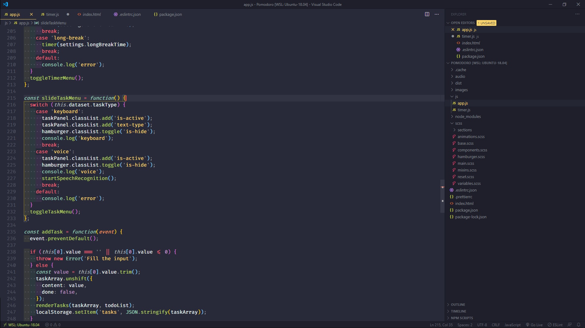

# WSL as a Development Environment 👨‍💻
**A set of configuration files for different editors, tools, terminals and similar stuff on Windows with installed WSL2.**
</br>


## Table of content
* [Windows Subsystem for Linux](#windows-subsystem-for-linux)
* [My Configs](#my-configs)
* [Visual Studio Code](#visual-studio-code)
* [Vim](#vim)
* [ZSH with Oh My Zsh](#zsh)
* [Git](#git)
* [Google chrome](#google-chrome)
* [Windows Terminal (preview)](#windows-terminal)
* [Other Software](#other-software)
* [Reference](#reference)

## Windows Subsystem for Linux
**The Windows Subsystem for Linux** lets developers run most command-line tools, utilities, and applications directly on Windows.

### Install 🛠 the Windows Subsystem for Linux
1. Open PowerShell as Admin and run:
```
dism.exe /online /enable-feature /featurename:Microsoft-Windows-Subsystem-Linux /all /norestart
```
2. Restart computer
3. Install [Ubuntu 18.04 LTS](https://www.microsoft.com/pl-pl/p/ubuntu-1804-lts/9n9tngvndl3q?rtc=1&activetab=pivot:overviewtab) or other Linux Distro

4. Enable Virtual Machine Platform
```
dism.exe /online /enable-feature /featurename:VirtualMachinePlatform /all /norestart
```
5. Setup WSL 2
```
wsl --set-version Ubuntu-18.04 2
```
>WSL 2 is only available in Windows 10, updated to version 2004, Build 19041 or higher.
6. Check what version of WSL your distro have
```
wsl -l -v
```
6. Any problems? checkout: https://docs.microsoft.com/en-us/windows/wsl/about

## My configs
A bash script for automated 🤖  installation of **[ZSH](#zsh)**, **[VIM](#vim)**, **[GIT](#git)**, **[WINDOWS TERMINAL](#windows-terminal)** configs.

1. Make sure you are in home directory and clone this repo
```
git clone https://github.com/adrian-karbowniczyn/wsl-config.git configs
```
2. Go into cloned folder
```
cd configs
```
3. Make script setup executable
```
chmod +x setup.sh
```
4. Run
```
./setup.sh
```
5. Follow instructions and enjoy 🔥

## [Visual Studio Code](https://code.visualstudio.com/)
Lightweight Code Editor, focused for web development.



### Theme
My favorite [Monokai Pro (Filter Octagon)](https://monokai.pro/vscode) in my opinion best theme out there !

### Config

```json
{
//Editor
"editor.fontFamily": "'Fira Code'",
"editor.fontSize": 16,
"editor.fontLigatures": true,
"editor.cursorBlinking": "expand",
"editor.cursorWidth": 3,
"editor.cursorSmoothCaretAnimation": true,
"editor.renderIndentGuides": false,
"editor.renderWhitespace": "boundary",
"editor.tabSize": 2,
"editor.snippetSuggestions": "inline",
"editor.suggest.localityBonus": true,
"editor.tabCompletion": "on",
"editor.formatOnPaste": true,
"editor.formatOnSave": true,

//Workbench
"workbench.colorCustomizations": {
"editorCursor.foreground": "#fe5d41",
"terminalCursor.foreground": "#fe5d41"
},
"workbench.statusBar.visible": true,
"workbench.activityBar.visible": false,
"workbench.sideBar.location": "right",

// Optional BUT IMPORTANT: If you have the prettier extension enabled for other languages like CSS and HTML, turn it off
"prettier.disableLanguages": ["javascript", "javascriptreact", "markdown"],
"editor.codeActionsOnSave": {
"source.fixAll.eslint": true
},

//Terminal settings
"terminal.integrated.cursorBlinking": true,
"terminal.integrated.enableBell": true,
"terminal.integrated.fontSize": 15,
"terminal.integrated.fontFamily": "'Fira Code'",

//Live server
"liveServer.settings.port": 5555,
"liveServer.settings.CustomBrowser": "firefox",
"liveServer.settings.donotShowInfoMsg": true,
"liveServer.settings.fullReload": true,
"tabnine.experimentalAutoImports": true,

//Other
"explorer.confirmDragAndDrop": false,
"window.menuBarVisibility": "toggle",
"files.trimTrailingWhitespace": true,
"files.eol": "\n",
"[javascript]": {
"editor.formatOnSave": false
},
"[javascriptreact]": {
"editor.formatOnSave": false
},
}
```

### Extensions

| Extension                                                                                                                  	| Descripton                                     	|
|----------------------------------------------------------------------------------------------------------------------------	|------------------------------------------------	|
| [Better Comments](https://marketplace.visualstudio.com/items?itemName=aaron-bond.better-comments)                          	| Improved comments                              	|
| [Bracket Pair Colorizer 2](https://marketplace.visualstudio.com/items?itemName=CoenraadS.bracket-pair-colorizer-2)         	| Colorize matching brackets                     	|
| [Debugger for Chrome](https://marketplace.visualstudio.com/items?itemName=msjsdiag.debugger-for-chrome)                    	| Debug JavaScript code in the Chrome            	|
| [ESLint](https://marketplace.visualstudio.com/items?itemName=dbaeumer.vscode-eslint)                                       	| Integrates ESLint into VS Code                 	|
| [GitLens — Git supercharged](https://marketplace.visualstudio.com/items?itemName=eamodio.gitlens)                          	| Supercharge the Git capabilities               	|
| [indent-rainbow](https://marketplace.visualstudio.com/items?itemName=oderwat.indent-rainbow)                               	| Makes indentation easier to read               	|
| [JavaScript Snippet Pack](https://marketplace.visualstudio.com/items?itemName=akamud.vscode-javascript-snippet-pack)       	| A snippet pack                                 	|
| [Live Server](https://marketplace.visualstudio.com/items?itemName=ritwickdey.LiveServer)                                   	| Local Server with live reload                  	|
| [Polacode](https://marketplace.visualstudio.com/items?itemName=PKief.material-icon-theme)                                  	| Polaroid for your code                         	|
| [Prettier - Code formatter](https://marketplace.visualstudio.com/items?itemName=pnp.polacode)                              	| Code formatter using prettier                  	|
| [Quokka.js](https://marketplace.visualstudio.com/items?itemName=esbenp.prettier-vscode)                                    	| Live Scratchpad for JavaScript                 	|
| [Rainbow Brackets](https://marketplace.visualstudio.com/items?itemName=esbenp.prettier-vscode)                             	| A rainbow brackets                             	|
| [Remote - WSL](https://marketplace.visualstudio.com/items?itemName=2gua.rainbow-brackets)                                  	| Open any folder in the WSL                     	|
| [Settings Sync](https://marketplace.visualstudio.com/items?itemName=2gua.rainbow-brackets)                                 	| Synchronize Settings                           	|
| [Import Cost](https://marketplace.visualstudio.com/items?itemName=Shan.code-settings-sync)                                 	| Display import package size in the editor      	|
| [Jest](https://marketplace.visualstudio.com/items?itemName=wix.vscode-import-cost)                                         	| Use Facebook's Jest With Pleasure              	|
| [jumpy](https://marketplace.visualstudio.com/items?itemName=Orta.vscode-jest)                                              	| Fast cursor movement                           	|
| [Markdown Preview Enhanced](https://marketplace.visualstudio.com/items?itemName=wmaurer.vscode-jumpy)                      	| Markdown Preview                               	|
| [Quick and Simple Text Selection](https://marketplace.visualstudio.com/items?itemName=shd101wyy.markdown-preview-enhanced) 	| Jump to select between quote, brackets, etc.   	|
| [TabNine](https://marketplace.visualstudio.com/items?itemName=dbankier.vscode-quick-select)                                	| Machine learning to help you write code faster 	|


## [Vim](https://www.vim.org/)
Vim is a highly configurable text editor built to make creating and changing any kind of text very efficient.


### Plugins
| Plugin                                                                 	| Description                                          	|
|------------------------------------------------------------------------	|------------------------------------------------------	|
| [Vim-plug](https://github.com/junegunn/vim-plug)                       	| Minimalistic Vim plugin manager                      	|
| [Fzf](https://github.com/junegunn/fzf.vim)                             	| Command-line fuzzy finder                            	|
| [NERDTree](https://github.com/preservim/nerdtree)                      	| File system explorer for the Vim                     	|
| [Lightline](https://github.com/itchyny/lightline.vim)                  	| Configurable statusline/tabline                      	|
| [Polyglot](https://github.com/sheerun/vim-polyglot)                    	| A collection of language packs for Vim               	|
| [Rainbow Parentheses Improved](https://github.com/luochen1990/rainbow) 	| Diff level of parentheses in diff color              	|
| [LiveDown](https://github.com/shime/livedown)       	                    | Instant preview of markdown files                    	|
| [Emmet](https://github.com/mattn/emmet-vim)                            	| Support for expanding abbreviations similar to emmet 	|
| [Gitgutter](https://github.com/airblade/vim-gitgutter)                 	| Shows a git diff in the sign column                  	|
| [Tabnine](https://www.tabnine.com/)                                    	| Deep learning to help you write code faster          	|


## ZSH
Z shell, is an extended version of the Bourne Shell (sh), with plenty of new features, and support for plugins and theme.


### Framework
[Oh My ZSH!](https://ohmyz.sh/)

### Theme
[spaceship](https://github.com/denysdovhan/spaceship-prompt)

### Aliases

```bash
alias gitk="gitk.exe"
alias gitgui="git-gui.exe"
alias clip="clip.exe"
alias explore="explorer.exe ."
alias ccat="pygmentize -O style=monokai -g"
```

### Plugins
| Plugin                                                                            | Description                                                           |
|---------------------------------------------------------------------------------  |-------------------------------------------------------------------    |
| [zsh-z](https://github.com/agkozak/zsh-z)                                         | Jump quickly to directories that you have visited frequently          |
| [zsh-syntax-highlighting](https://github.com/zsh-users/zsh-syntax-highlighting)   | Syntax highlighting for the shell zsh                                 |
| [fzf](https://github.com/junegunn/fzf)                                            | General-purpose command-line fuzzy finder                             |
| [zsh-autosuggestions](https://github.com/zsh-users/zsh-autosuggestions)           | It suggests commands as you type based on history and completions     |

## [Git](https://git-scm.com/)

### How to use WinMerge as a diff/merge tool in WSL2

Copy and pase to .gitconfig file:
```bash
[mergetool]
prompt = false
keepBackup = false
keepTemporaries = false

[merge]
tool = winmerge

[mergetool "winmerge"]
name = WinMerge
trustExitCode = true
cmd = "/mnt/c/Program\\ Files/WinMerge/WinMergeU.exe" -u -e -fm -wl -dl "Local" -wr -dr "Remote" $(wslpath -aw $LOCAL) $(wslpath -aw $MERGED) $(wslpath -aw $REMOTE)

[diff]
tool = winmerge

[difftool "winmerge"]
name = WinMerge
trustExitCode = true
cmd = "/mnt/c/Program\\ Files/WinMerge/WinMergeU.exe" -u -e  $(wslpath -aw $LOCAL) $(wslpath -aw $REMOTE)

```

### AHK  aliases
A lot of useful aliases that makes working with git a little bit faster 🔥

```bash
; **git-specific

::gstl::git stash list
::gfp::git fetch --prune --prune-tags
::grso::git remote show origin
::glo::git log --oneline --graph
::glop::git log --graph --pretty=format:'%Cred%h%Creset %w(72,1,2)%s -%C(yellow)%d%Creset %Cgreen(%cr) %C(bold blue)<%an>%Creset' --abbrev-commit --date=relative
::glcp::git log -S  --format=%h | clip{left 19}
::gm::git merge
::gs::git status
::gl::git ll
::gd::git diff --word-diff
::gdt::git difftool
::gmt::git mergetool
::gc::git commit
::gcae::git commit --allow-empty
::gch::git checkout
::gr::git rebase -i
::gb::git branch
::gst::git stash
::ga::git add -p
::gai::git add -i
::gf::git fetch
::gph::git push
::gignore::git update-index --assume-unchanged
::gunignore::git update-index --no-assume-unchanged
::gmnff::git merge --no-ff -e -m "" -
::-h::--help
```
## [Google chrome](https://www.google.com/intl/pl_pl/chrome/)
I use google chrome for general purpose, when working with css switch to the [**Firefox**](https://www.mozilla.org/pl/firefox/new/)
### Extensions
| Extension                                                                                                                                     | Description                                                       |
|--------------------------------------------------------------------------------------------------------------------------------------------   |----------------------------------------------------------------   |
| [Wappalyzer](https://chrome.google.com/webstore/detail/wappalyzer/gppongmhjkpfnbhagpmjfkannfbllamg?hl=en)                                     | A utility that uncovers the technologies used on websites         |
| [WhatFont](https://chrome.google.com/webstore/detail/whatfont/jabopobgcpjmedljpbcaablpmlmfcogm/related?hl=en)                                 | Identify fonts on web pages                                       |
| [Check My Links](https://chrome.google.com/webstore/detail/check-my-links/ojkcdipcgfaekbeaelaapakgnjflfglf?hl=en-GB)                          | Checker that crawls through webpage and looks for broken links    |
| [JSONView](https://chrome.google.com/webstore/detail/jsonview/chklaanhfefbnpoihckbnefhakgolnmc/related?hl=en)                                 | Validate and view JSON documents                                  |
| [React Developer Tools](https://chrome.google.com/webstore/detail/react-developer-tools/fmkadmapgofadopljbjfkapdkoienihi)                     | React debugging tools to the Chrome                               |
| [Vue.js devtools](https://chrome.google.com/webstore/detail/vuejs-devtools/nhdogjmejiglipccpnnnanhbledajbpd)                                  | Extension for debugging Vue.js applications                       |
| [Material DevTools Theme Collection](https://chrome.google.com/webstore/detail/material-devtools-theme-c/jmefikbdhgocdjeejjnnepgnfkkbpgjo)    | Material DevTools Theme Collection                                |
| [ChromeVox Classic ](https://chrome.google.com/webstore/detail/chromevox-classic-extensi/kgejglhpjiefppelpmljglcjbhoiplfn)                    | Screen reader; **ALT+SHIFT+AA TO TOGGLE ON/OFF**                  |
| [Window Resizer](https://chrome.google.com/webstore/detail/window-resizer/kkelicaakdanhinjdeammmilcgefonfh)                                   | Resize the browser window                                         |
